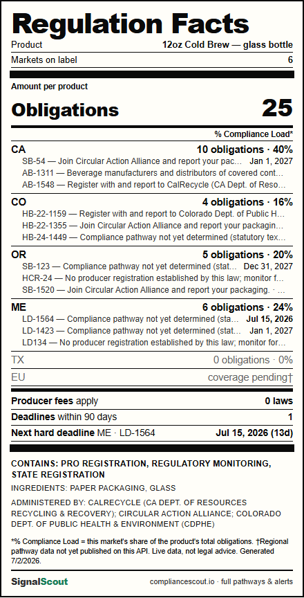

# EPR Nutrition Label 🏷️

> *"Nobody shares an API response. Everybody shares a scorecard."* — Priya "Press Kit" Vasquez
> (persona blend: 55% design / 30% business / 15% dev)

**Regulation Facts** for any product: pick the materials it's made of and the markets you sell
into, and get an FDA-nutrition-panel-styled label of its Extended Producer Responsibility
exposure — obligations per market, % compliance load, producer-fee count, the next hard
deadline, and an allergen-style **CONTAINS: PRO REGISTRATION, PRODUCER FEES** line.
Download it as a PNG and drop it in a board deck. Every export carries the SignalScout
mark — the artifact *is* the distribution channel.

## Run

```
node server.js
# → http://localhost:4747
```

Zero npm dependencies (Node 18+ for global `fetch`). The PNG export uses html2canvas from a
CDN; offline it falls back to the browser's print dialog.

## Config

| env | default |
| --- | --- |
| `SIGNALSCOUT_API_BASE_URL` | SignalScout prod API |
| `PORT` | `4747` |

## How it works

The browser can't call the SignalScout API cross-origin (CORS allows only the dashboard),
so `server.js` proxies. `GET /api/label?materials=glass,paper_packaging&states=CA,CO&regions=EU`
fans out one `/compliance/pathways` call per jurisdiction (the pathways payload doesn't carry
state/region, so per-jurisdiction calls are how obligations get attributed), filters by
material overlap (honoring the `ALL` wildcard), and aggregates into the label JSON:
totals, per-market rows with the top 3 actions, deadline stats, the "contains" set derived
from `action_type` + `has_fee`, and the administering PROs/agencies.



## Found during the build 🐛

Prod currently **ignores the `region` query param** on `/compliance/pathways` *and* `/bills`
(`?region=ZZ` returns all 266 pathways; `/bills?region=EU` returns Ohio bills with
`region: null`) — the multi-region work (migration 031) hasn't been promoted yet. Naively
trusting the param attributed 41 US obligations to the EU. The server probes once at first
region request (`region=ZZ` → `[]` means region-aware) and renders un-promoted regions as
"coverage pending†" instead of lying. Point `SIGNALSCOUT_API_BASE_URL` at a region-aware
API (local dev lane) and EU/FR/JP rows light up for real.

## Demo script (90 seconds)

1. "This is a 12oz cold brew in a glass bottle. We sell it in California, Colorado, Oregon,
   Maine, Texas, and the EU."
2. Hit **Generate label** → the Regulation Facts panel fills in live from prod data.
3. Point at Texas: zero obligations, greyed out. Point at the red deadline. Point at
   **CONTAINS: PRO REGISTRATION, PRODUCER FEES**.
4. Hit **PNG ↓** → "and this is the version your VP of Ops forwards to the CEO."
